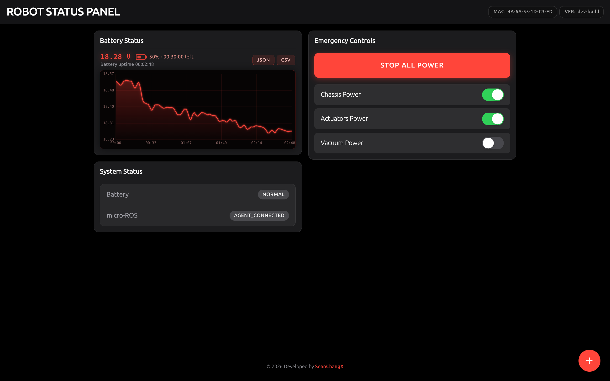
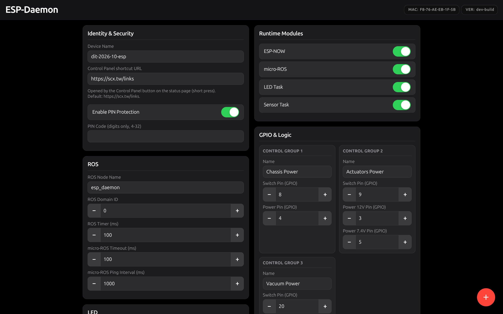
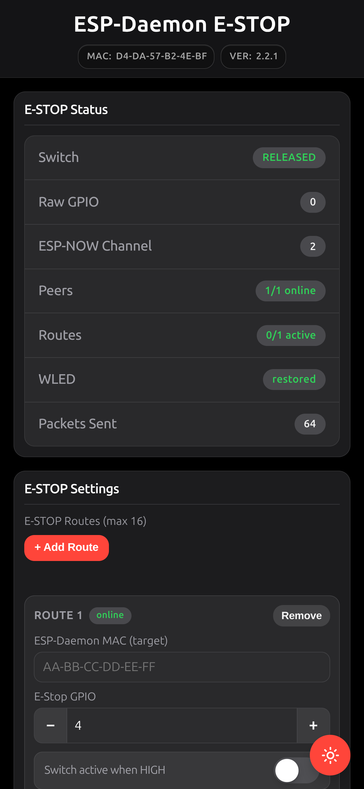
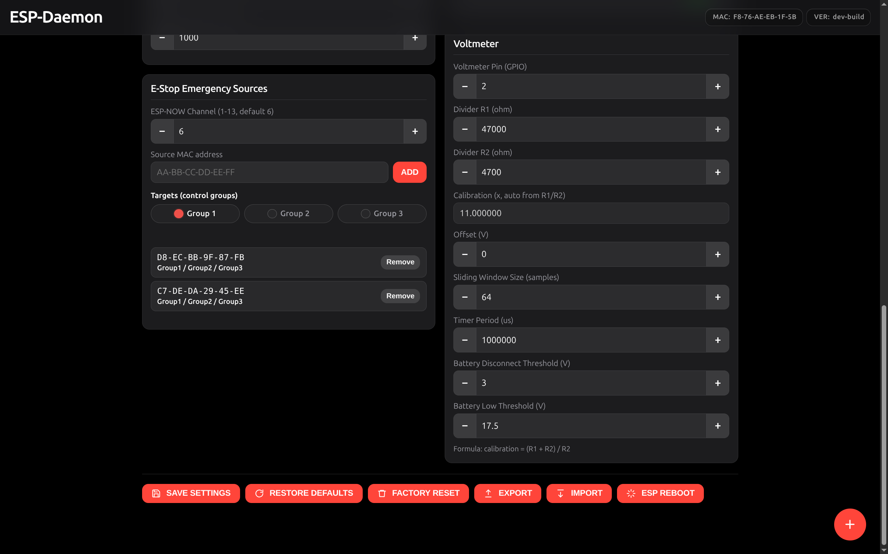

<div align="center">

# ESP-Daemon

**ESP32-C3 robot status daemon and wireless emergency stop**

[](./LICENSE)
[](./esp_firmware)
[](https://dit-robotics.github.io/ESP-Daemon)
[](https://github.com/DIT-ROBOTICS/ESP-Daemon/releases)
<br>
[](./docker-compose.yaml)
[](https://docs.ros.org/en/humble/index.html)
[](#micro-ros--docker)
[](#e-stop-over-esp-now)
[](#led-and-wled)

</div>

<table>
<tr>
<td width="50%" align="center">

</td>
<td width="50%" align="center">

</td>
</tr>
<tr>
<td width="50%" align="center">
<strong>Home Page</strong><br>
Battery log, emergency button, power controls, micro-ROS link status.
</td>
<td width="50%" align="center">
<strong>Settings Page</strong><br>
Identity &amp; security, runtime modules, ROS parameters, GPIO and I/O logic.
</td>
</tr>
<tr>
<td width="50%" align="center">

</td>
<td width="50%" align="center">

</td>
</tr>
<tr>
<td width="50%" align="center">
<strong>E-STOP hardware</strong><br>
Physical button unit for field wireless stop.
</td>
<td width="50%" align="center">
<strong>E-STOP status (mobile)</strong><br>
Switch state, ESP-NOW channel, peers/routes, packet counters, route configuration.
</td>
</tr>
</table>

<div align="center">

[Features](#features) &#8226;
[Quick start](#quick-start) ([Flash firmware](#flash-firmware), [Network &amp; web access](#network-setup--web-access)) &#8226;
[E-Stop over ESP-NOW](#e-stop-over-esp-now) &#8226;
[Voltmeter](#voltmeter) &#8226;
[micro-ROS &amp; Docker](#micro-ros--docker) ([Typical topics](#typical-topics)) &#8226;
[LED and WLED](#led-and-wled) &#8226;
[Configuration &amp; telemetry](#configuration--telemetry) &#8226;
[Updates](#updates) &#8226;
[HTTP API](#http-api) &#8226;
[Repository layout](#repository-layout)

</div>

---

## Features

| Capability | Summary |
|------------|---------|
| **ESP-Daemon (main image)** | HTTP dashboard and settings, three power control groups (GPIO outputs), ADC voltmeter and battery state, onboard NeoPixel strip, ESP-NOW receiver for whitelisted E-STOP sources, optional micro-ROS over UART. |
| **E-Stop (sender image)** | Debounced GPIO input, ESP-NOW routes to one or more daemon MACs, optional passive buzzer and WLED preset sync over HTTP. |
| **micro-ROS** | `micro_ros_agent` on serial; node publishes `std_msgs` telemetry and subscribes to `std_msgs/Bool` per control group ([Typical topics](#typical-topics)). |
| **ESP-NOW emergency path** | Daemon matches sender MAC against `emergencySources[]`; authorized `STOP` traffic triggers emergency shutdown of selected groups. |
| **Configuration** | Structured JSON export/import, NVS storage; factory reset wipes NVS including Wi-Fi credentials. |

---

## Quick start

| Phase | Action |
|-------|--------|
| Flash Firmware | Select `ESP-Daemon` or `E-STOP` and flash with the [Web Flasher](https://dit-robotics.github.io/ESP-Daemon/). |
| Network Setup | First boot: join device AP and complete Wi-Fi provisioning (captive portal). |
| Web Access | Open `http://<device-name>.local` after provisioning. |
| Default Settings | Runtime modules (ESP-NOW, micro-ROS, LED task, sensor task) are enabled by default; adjust in Settings as needed. |

---

### Flash Firmware

**Web Serial** (Chrome / Edge 89+): connect USB (e.g. XIAO ESP32-C3), open the [ESP-Daemon Flasher](https://dit-robotics.github.io/ESP-Daemon/), choose product `ESP-Daemon` or `E-Stop`, **CONNECT & FLASH**. If enumeration fails, hold **BOOT** and retry.

**PlatformIO** (local upload):

```bash
cd esp_firmware

# Flash firmware
pio run -e seeed_xiao_esp32c3_prod -t upload
pio run -e seeed_xiao_esp32c3_estop -t upload

# Flash the filesystem (for web UI/assets)
pio run -e seeed_xiao_esp32c3_prod -t uploadfs
pio run -e seeed_xiao_esp32c3_estop -t uploadfs

```

### Network Setup & Web Access

| State | Behavior |
|-------|----------|
| **Unprovisioned** | Device opens AP: Daemon `ESP-Daemon_XXXXXX`, E-STOP `ESP-EStop_XXXXXX`. Captive portal ([192.168.4.1](http://192.168.4.1)) or manual browser for Wi-Fi setup. |
| **Provisioned** | Prefer mDNS: `http://esp-daemon_xxxxxx.local`, `http://esp-estop_xxxxxx.local`. Fallback: DHCP-assigned IP. |

---

## E-STOP over ESP-NOW

**Overview:** The E-STOP sender transmits ESP-NOW frames while the button is pressed. The daemon accepts packets only from MAC addresses listed under **E-Stop Emergency Sources** and applies emergency shutdown to the selected control groups.

<div align="center">

</div>

### Prerequisites

| Requirement | Notes |
|-------------|--------|
| Images | One board flashed `E-STOP`, one `ESP-Daemon`. |
| Runtime | **ESP-NOW** enabled on both (`Runtime Modules`). |
| RF / channel | Same Wi-Fi environment so channel alignment is possible; offline operation uses manual `ESP-NOW Channel`. |
| Identity | E-STOP MAC required for whitelist (see `GET /device` or UI banner). |

### Daemon configuration (whitelist)

On the **Settings** page, card **E-Stop Emergency Sources** (figure above).

| Field | Constraint |
|-------|------------|
| `ESP-NOW Channel` | 1–13 (default 6). |
| `Source MAC address` | 12 hex digits; UI accepts `AA-BB-CC-DD-EE-FF` style. |
| `Targets (control groups)` | At least one of Group 1 / 2 / 3 per entry. |

Duplicate MACs are rejected. **SAVE SETTINGS** persists to NVS. Matching is **exact MAC**; no payload parsing beyond authorized source.

### E-Stop sender configuration

UI: `/estop.html`. Configure one or more **routes**:

| Route field | Purpose |
|-------------|---------|
| `ESP-Daemon MAC (target)` | Destination peer MAC. |
| `E-Stop GPIO` | Switch input pin. |
| `Switch active when HIGH` / `Invert pressed/released logic` | Debounced logic. |

While pressed, firmware sends `STOP` to configured targets at approximately **80 ms** intervals.

---

## Voltmeter

Same Settings page (see figure above, **Voltmeter** card).

| Parameter | Role |
|-----------|------|
| `Voltmeter Pin` | ADC GPIO. |
| `Divider R1` / `Divider R2` | Divider network; calibration factor `x = (R1+R2)/R2` when R2 &gt; 0. |
| `Calibration` | Read-only display from R1/R2 in UI; firmware recomputes from divider values. |
| `Offset (V)` | Trim after bench measurement. |
| `Sliding Window Size` | Averaging depth. |
| `Timer Period (us)` | Sample timer. |
| `Battery Disconnect Threshold` / `Battery Low Threshold` | `batteryLowThreshold` ≥ `batteryDisconnectThreshold`. |

**Status output:** `NORMAL`, `LOW`, or `DISCONNECTED` (debounced connect/disconnect detection).

### Host-side low-battery alerting

The device exposes low-battery data via HTTP and ROS 2; desktop or fleet alerting is implemented on the host. [DIT-Scripts](https://github.com/DIT-ROBOTICS/DIT-Scripts) can provision an Ubuntu desktop host; integrate with either:

- `GET /readings` → `batteryStatus`
- Topic `/robot_status/battery_voltage` (`std_msgs/Float32`) when micro-ROS is active

---

## micro-ROS & Docker

<div align="center">

</div>

### Device settings (Daemon)

| Section | Fields |
|---------|--------|
| **Runtime Modules** | `micro-ROS` enabled. |
| **ROS** | Node name, domain ID (0–232), timer (ms), micro-ROS timeout (ms), ping interval (ms). |

Transport: UART to `micro_ros_agent` (see firmware `Serial`).

### Agent workspace (one-time bootstrap)

Builds `micro_ros_setup` and agent workspace inside the mounted tree (`esp_daemon_ws/micro-ROS_install.sh`):

```bash
docker compose run --rm esp-daemon bash -lc 'cd /home/ros/esp_daemon && chmod +x micro-ROS_install.sh && ./micro-ROS_install.sh'
```

### Routine operation

```bash
docker compose up -d --build
```

`docker-compose.yaml` runs `entrypoint.sh`, which sources `~/esp_daemon/install/setup.bash` and then:

```bash
ros2 run micro_ros_agent micro_ros_agent serial --dev /dev/ttyACM0
```

Requires `/dev/ttyACM0` present (device USB, `privileged: true`, `/dev` bind mount).

**Host environment:** `docker-compose.yaml` passes `ROS_DOMAIN_ID` from the host into the container. Set it to the **same value** as **ROS Domain ID** on the device (Settings → ROS); default is `0` on both sides if unset. Build args use `ROS_DISTRO` from `.env` (e.g. `humble`).

### Typical topics

Defined in `esp_firmware/lib/ros_node/ros_node.cpp`. All messages use `std_msgs`.

| Topic | Dir | Message type | Field |
|-------|-----|--------------|--------|
| `/esp32_counter` | Pub | `std_msgs/msg/Int32` | `data` — monotonic counter from timer |
| `/robot_status/battery_voltage` | Pub | `std_msgs/msg/Float32` | `data` — pack voltage (V) |
| `/robot_status/control_group1_enable` | Sub | `std_msgs/msg/Bool` | `data` — group 1 power enable |
| `/robot_status/control_group2_enable` | Sub | `std_msgs/msg/Bool` | `data` — group 2 power enable |
| `/robot_status/control_group3_enable` | Sub | `std_msgs/msg/Bool` | `data` — group 3 power enable |

---

## LED and WLED

### Daemon (NeoPixel strip)

| Setting | Notes |
|---------|--------|
| **Runtime Modules** | `LED Task` enabled. |
| `LED Pin`, `LED Count`, `LED Brightness`, `LED Override Duration (ms)` | Hardware strip. |

Patterns reflect system state (e.g. battery, emergency). Override duration caps temporary modes.

### E-STOP (WLED HTTP API)

| Setting | Notes |
|---------|--------|
| `estopWledEnabled` | Master switch. |
| `estopWledBaseUrl` | Must include `http://` or `https://`; trailing slash stripped. |
| `estopWledPressedPreset` / `estopWledReleasedPreset` | Preset IDs 1–250. |

On press/release edges, firmware calls `POST {baseUrl}/json/state` with `{"on": true, "ps": <preset>}` when Wi-Fi is connected. Status is exposed on `/estop/status` (`wledStatus`).

---

## Configuration & telemetry

| Topic | Details |
|-------|---------|
| **Persistence** | Settings are stored in NVS (`Preferences`). Export/import uses structured JSON (`esp-daemon.settings-export` / `esp-estop.settings-export` schemas). |
| **UI actions** | **EXPORT** / **IMPORT** — backup and restore. **RESTORE DEFAULTS** — firmware defaults, keeps NVS layout. **FACTORY RESET** — erases NVS including Wi-Fi credentials; device reboots. |
| **PIN (Daemon only)** | When PIN protection is enabled, `POST /settings/*` bodies must include a valid `authPin`; use `POST /settings/unlock` from the UI flow. E-STOP settings endpoints do not use PIN. |
| **Battery telemetry** | `GET /telemetry` returns a discharge session sampled at 1 Hz while connected (max ~7200 points, ~2 h). Default responses are downsampled for UI performance; use `?full=1` for full export, or `?maxPoints=<n>` to cap response points. |

---

## Updates

| Method | Entry |
|--------|--------|
| Web Flasher | [ESP-Daemon Flasher](https://dit-robotics.github.io/ESP-Daemon/) (USB, Web Serial). |
| OTA | `http://<device-name>.local/update` (ElegantOTA). |
| PlatformIO | Commands under [Flash Firmware](#flash-firmware). |

---

## HTTP API

JSON request bodies use `Content-Type: application/json` unless noted. Routes depend on firmware image: **Daemon** and **E-STOP** expose different paths (see `esp_firmware/lib/web_server/web_server.cpp`).

### Route map

**ESP-Daemon (main image)**

| Method | Path | Purpose |
|--------|------|---------|
| `GET` | `/` | Web UI (`index.html`) |
| `GET` | `/health` | Liveness (`ok`) |
| `GET` | `/device` | Version, MAC, `settingsPinRequired` |
| `GET` | `/readings` | Sensors + `batteryStatus` |
| `GET` | `/telemetry` | Battery discharge session JSON (`?maxPoints=<n>`, `?full=1`) |
| `POST` | `/power` | JSON: `controlGroup{1,2,3}Power` |
| `POST` | `/emergency` | JSON: `emergency` (bool) — **control group 1 only** (legacy shortcut) |
| `POST` | `/settings/unlock` | JSON: `pin` |
| `POST` | `/settings/read` | JSON: `authPin` |
| `POST` | `/settings` | Full settings JSON + `authPin` |
| `POST` | `/settings/export` | JSON: `authPin` |
| `POST` | `/settings/import` | JSON: `authPin`, `settings` |
| `POST` | `/settings/reset` | JSON: `authPin` |
| `POST` | `/settings/factory-reset` | JSON: `authPin` |
| `POST` | `/esp/reboot` | JSON: `authPin` |
| — | `/update` | OTA UI (ElegantOTA) |

**E-STOP (sender image)**

| Method | Path | Purpose |
|--------|------|---------|
| `GET` | `/` | Web UI (`estop.html`) |
| `GET` | `/device` | Version, MAC |
| `GET` | `/estop/status` | Switch, routes, ESP-NOW, WLED status |
| `POST` | `/esp/reboot` | Reboot |

### curl examples

Environment variables:

```bash
ESP="http://esp-daemon_xxxxxx.local"
ESTOP="http://esp-estop_xxxxxx.local"
PIN="1234"   # if PIN protection enabled in Settings
```

**ESP-Daemon**

```bash
curl -fsS "$ESP/health"
curl -fsS "$ESP/device"
curl -fsS "$ESP/readings"
curl -fsS "$ESP/telemetry"
curl -fsS "$ESP/telemetry?maxPoints=120"   # UI-style downsampled response
curl -fsS "$ESP/telemetry?full=1"          # full session (for export/download)

curl -fsS -X POST "$ESP/power" -H "Content-Type: application/json" \
  -d '{"controlGroup1Power":true}'
curl -fsS -X POST "$ESP/power" -H "Content-Type: application/json" \
  -d '{"controlGroup1Power":false,"controlGroup2Power":false,"controlGroup3Power":false}'

# Legacy: group 1 only
curl -fsS -X POST "$ESP/emergency" -H "Content-Type: application/json" \
  -d '{"emergency":true}'

curl -fsS -X POST "$ESP/settings/read" -H "Content-Type: application/json" \
  -d "{\"authPin\":\"$PIN\"}"
curl -fsS -X POST "$ESP/settings/export" -H "Content-Type: application/json" \
  -d "{\"authPin\":\"$PIN\"}"
curl -fsS -X POST "$ESP/esp/reboot" -H "Content-Type: application/json" \
  -d "{\"authPin\":\"$PIN\"}"
```

**E-STOP**

```bash
curl -fsS "$ESTOP/device"
curl -fsS "$ESTOP/estop/status"
curl -fsS -X POST "$ESTOP/esp/reboot" -H "Content-Type: application/json" -d '{"authPin":""}'
```

### Optional: desktop shortcut (Ubuntu)

**Settings → Keyboard → Custom Shortcuts:** command example for disabling groups 2 and 3 via non-interactive shell:

```bash
bash -lc 'curl -fsS -X POST "http://esp-daemon_xxxxxx.local/power" -H "Content-Type: application/json" -d "{\"controlGroup2Power\":false,\"controlGroup3Power\":false}"'
```

---

## Repository layout

```text
ESP-Daemon/
├── docs/                  # Documentation assets
├── esp_daemon_ws/         # ROS 2 / micro-ROS agent workspace
├── esp_firmware/          # ESP32 firmware (ESP-Daemon / E-STOP)
├── tools/                 # Web Flasher and related tooling
├── docker-compose.yaml    # ROS 2 container
└── README.md
```

---

## License

MIT License. See [`LICENSE`](./LICENSE).
